### ✍️ Tangxt ⏳ 2021-10-08 🏷️ CSS

# 深入理解 CSS：font metrics（字体度量）、line-height 和 vertical-align

> 原文：[Deep dive CSS: font metrics, line-height and vertical-align - Vincent De Oliveira](https://iamvdo.me/en/blog/css-font-metrics-line-height-and-vertical-align)

`Line-height` 和 `vertical-align` 都是简单的 CSS 属性。它们是如此的简单，以至于我们大多数人都确信能够完全理解它们是如何工作的以及如何使用它们。但事实并非如此。它们真的很复杂，也许是最难的，因为**它们在创建一个鲜为人知的 CSS 特性：内联格式化上下文（inline formatting context）过程中扮演着重要角色。**

例如，可以将 `line-height` 的值设置为长度（length，如`16px`） 或无单位值 `1`（不管你选择什么，这都不是重点），但它的默认值是 `normal`。然而，什么是`normal`呢？我们经常读到它是（或者应该是）`1`，或者可能是 `1.2`，甚至连 [CSS 规范在这一点上也不清楚](https://www.w3.org/TR/CSS2/visudet.html#propdef-line-height)。我们知道无单位的`line-height`是相对于`font-size`的，但问题是 `font-size:100px` 在不同的字体族（font-families）中其表现是有所不同的，所以`line-height`总是相同还是不同？真的在`1`到`1.2`之间吗？还有，`vertical-align`它对`line-height`又有什么影响呢？

深入研究一个不那么简单的 CSS 机制……

## Let’s talk about `font-size` first

看看这个简单的 HTML 代码，一个`<p>`包含 3 个`<span>`，并且这每个`<span>`都有不同的`font-family`：

``` html
<p>
  <span class="a">Ba</span>
  <span class="b">Ba</span>
  <span class="c">Ba</span>
</p>
```

``` css
p  { font-size: 100px }
.a { font-family: Helvetica }
.b { font-family: Gruppo    }
.c { font-family: Catamaran }
```

我们使用了相同的`font-size`，不同的字体种类（font-families，字体族、字体系列），得到了不同高度的元素：

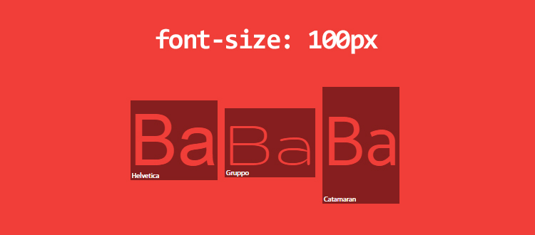

> 1. 不同的字体系列，相同的字体大小，得到了不同的高度

即使我们意识到了这种行为，但为什么 `font-size: 100px` 不能创建高度为 `100px` 的元素呢？我测量这些元素并发现了这些值：Helvetica: 115px，Gruppo: 97px 和 Catamaran: 164px

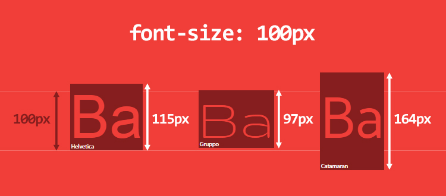

> 2. `font-size: 100px`的元素，其高度从`97px`到`164px`不等……

虽然一开始看起来有点奇怪，但完全在意料之中。原因在于字体本身。以下是它的工作原理：

- 字体定义了它的 [em-square](http://designwithfontforge.com/en-US/The_EM_Square.html)（or UPM, units per em），一种（抽象的方形）容器，每个字符将在其中绘制。该 square 使用相对单位（relative units），通常设置为 1000 个单位（OpenType 字体情况），当然，它（TrueType 字体情况，2 的几次方）也可以是 1024、2048 或其他。
  
   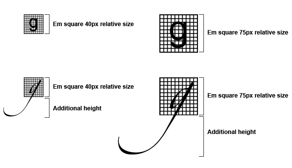
  
- 基于字体的相对单位来设置字体的度量（ascender, descender, capital height, x-height, etc.）。请注意，某些值可能会溢出 em-square 之外。
  
  

- 在浏览器中，相对单位会缩放以适合所需的字体大小 -> 一般缩小 10 倍

让我们使用 Catamaran 字体并在 [FontForge](https://fontforge.github.io/en-US/) 中打开它来获得它的度量：

- em-square 是 1000
- ascender 是 1100，descender 是 540。在运行了一些测试之后，似乎在 Mac OS 上的浏览器使用的是 HHead Ascent/Descent 值，而在 Windows 上的浏览器则使用 Win Ascent/Descent 值（这些值可能不同！）。我们还注意到 Capital Height 是 680，X height 是 485

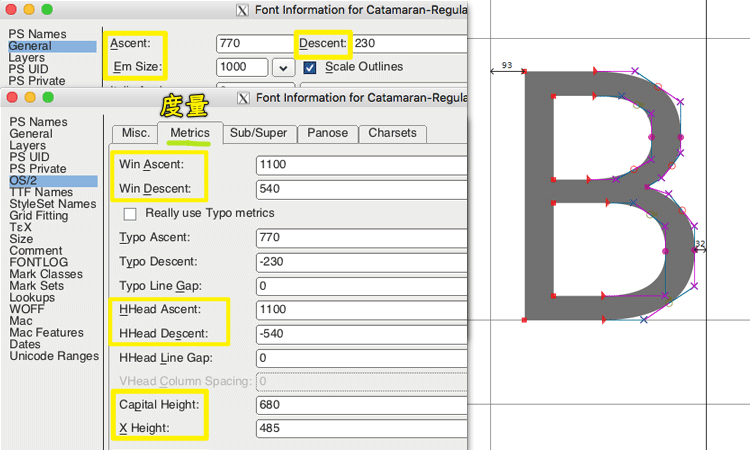

> 3. 使用 FontForge 得到这种字体的字体度量值

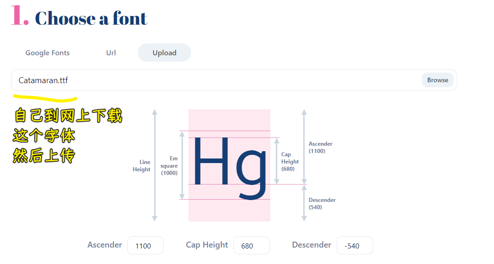

> 这个 [Catamaran.ttf](http://xiazaiziti.com/138180.html) 是 TrueTypeFont，然而是 1000 em-square，我还以为是是 2 的 x 次方……当然，这都是通常惯例！ -> 好像`.ttf`也可以是 OpenType 字体定义的后缀！（OpenType 也叫 Type 2 字体，是由 Microsoft 和 Adobe 公司开发的另外一种字体格式。OpenType 字体比 TrueType 更为强大）

这意味着 Catamaran 字体在 1000 个单位的 em-square 中使用 1100 + 540 个单位，当设置`font-size: 100px`时，Catamaran 字体的高度为 164px。**这个计算出的高度定义了元素的 content-area（内容区域）**，我将在本文的其余部分使用这个术语。你可以将内容区域视为应用`background`属性的区域（严格来说这不是这样的 -> 正确来说是`border+padding+content`，但我们不加`border+padding`，那就可以这样认为了）。

我们也可以预知到，大写字母为 68px 高 (680 个单位），小写字母 (x-height) 为 49px 高 (485 个单位）。所以，`1ex = 49px`，`1em = 100px`，而不是 164px（谢天谢地，`em` 是基于 font-size，而不是计算出来的高度）

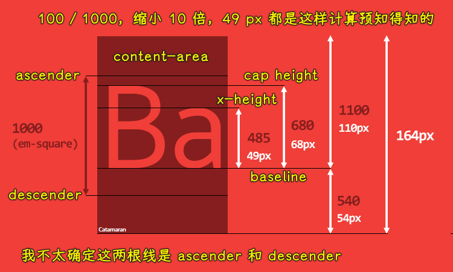

> 4. Catamaran 字体：UPM —Units Per Em— and pixels equivalent using font-size：100px（使用和`font-size:100px`等效的像素）

在继续深入讨论之前，先简要说明一下这会涉及的内容。当一个`<p>`元素在屏幕上呈现时，根据它的宽度，它可以由多行组成。每一行由一个或多个内联元素 (HTML 标签或用于文本内容的匿名内联元素）组成，这每一行被称之为「line-box」。**line-box 的高度是基于其所有子元素的高度计算而来的**。因此，浏览器会计算这一行里每个内联元素的高度，从而计算出 line-box 的高度（从其子元素的最高点到其子元素的最低点）。所以，默认情况下，一个 line-box 总是有足够的高度来包含它的所有子元素。

> 每个 HTML 元素实际上是一堆 line-boxex（就像一摞书一样）。如果知道每个 line-box 的高度，那你就可以知道一个元素的高度。


如果我们像这样更新先前的 HTML 代码：

``` html
<p>
  Good design will be better.
  <span class="a">Ba</span>
  <span class="b">Ba</span>
  <span class="c">Ba</span>
  We get to make a consequence.
</p>
```

它将会生成 3 个 line-box：

- 第一个和最后一个分别包含一个匿名内联元素（也就是文本内容）
- 第二个包含两个匿名内联元素以及 3 个`<span>`

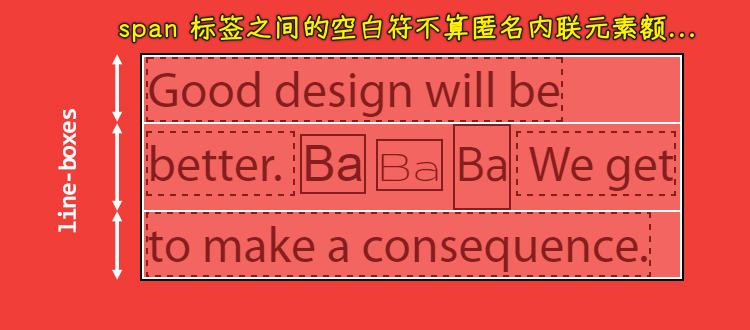

> 一个`<p>`（黑色边框）由多个 line-box（白色边框）组成，其中 line-box 包含了内联元素（实线`solid`边框）匿名内联元素（虚线 `dashed` 边框）

我们可以清楚地看到，第二个 line-box 要比其他 line-box 高，因为这是根据其子元素的内容区域（content-area）而计算得来的高度，更具体地说，是使那个 Catamaran 字体的 `span`。

**困难的是 line-box 创建部分我们不能真正看到它，也无法用 CSS 控制它**。即使我们用 `::first-line` 给第一行加上背景色也无法直接在视觉上看到第一个 line-box 的高度。

## line-height: to the problems and beyond

到目前为止，我介绍了两个概念：content-area 和 line-box。如果你读得很好，你会发现我告诉了你一个 line-box 的高度是根据它的子高度计算出来的，并没有说是它的子元素的 content-area 的高度。这是有很大区别的。

接下来说句听起来很奇怪的话：**一个内联元素有两个不同的高度：content-area 高度和 virtual-area （实际区域？）高度**（virtual-area 是我自己发明的术语，因为该高度对我们是不可见的，你在规范中是找不到关于这个「术语」任何相关的内容）。

* content-area 的高度是由字体度量定义的（见上文）
* **vitual-area 的高度就是 `line-height`**，这个高度**用于计算 line-box 的高度**

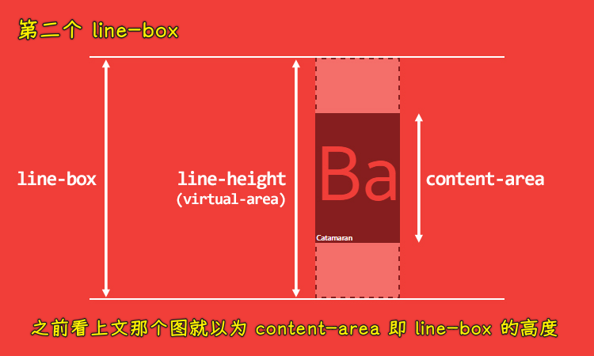

> 6. 内联元素有两个不同的高度

也就是说，这就打破了一个长久流行的观点，即`line-height`是两个 baseline 之间的距离。在 CSS 中，它并不是这样的。（在其他编辑软件中，它可能是基线之间的距离。在 Word 或者 Photoshop 中，情况就是这样。这主要的区别在于第一行也受到 CSS 的影响）

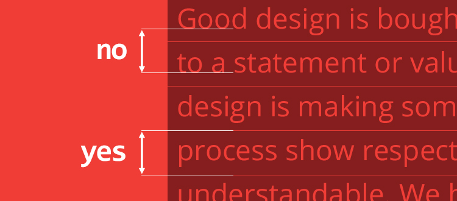

> 7. 在 CSS 中，line-height 不是两个基线之间的距离

计算出 virtual-area 和 content-area 之间的高度差异被叫做「leading」。leading 的一半会被加到 content-area 顶部，而另一半则会被加到底部。**因此 content-area 总是处于 virtual-area 的中间**。

根据其计算值，计算出来的 `line-height`（也就是 virtual-area 的高度）可以等于、大于或小于 content-area。在 virtual-area 小于 content-area 的情况下，leading 就是负的，因此 line-box 在视觉上就比内容（它的子元素们）还矮了。

还有一些其他种类的内联元素：

* 可替换的内联元素（如 ``, `<input>`, `<svg>`等）
* `inline-block` 元素，以及所有 `display` 值以 `inline-` 开头的元素（简称`inline-*`元素），如 `inline-table`、`inline-flex`等
* 处于某种特殊格式化上下文的内联元素，例如 flexbox 元素中的子元素都处于 flex formatting context（弹性格式化上下文）中，这些子元素（flex item）的 `display` 值都是「blockified」

对于这些特定的内联元素，其高度是基于 `height`、`margin` 和 `border` 属性（译者注：好像漏了 `padding`，又或者是`height+padding+border`，没有`margin`，因为内联元素上下`margin`是不生效的）来计算的。如果你将其 `height` 设置为 `auto` 的话，那么其高度的取值就是 `line-height`，其 content-area 的取值严格等于`line-height`。

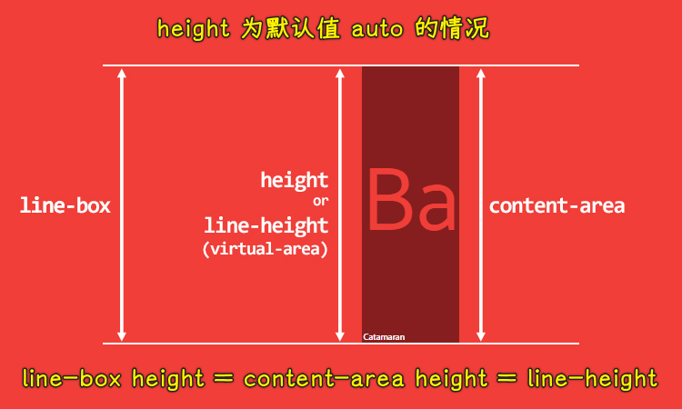

> 8. Inline replaced elements, inline-block/inline-* and blocksified inline elements 的 content-area 等于它们的 height 或者 line-height

无论如何，我们目前依然没有解释 `line-height` 是`normal`的意思。要解答这个问题，我们又得回到 content-area 高度的计算了，问题的答案就在字体度量里面。

让我们回到 FontForge，Catamaran 的 em-square 高度是 1000，同时我们还看到很多其他的 ascender/descender 值：


* 常规的（generals）Ascent/Descent：ascender 是 770，descender 是 230，用于渲染字符（character drawings）。（table “OS/2”）
* 规格（metrics）Ascent/Descent：ascender 是 1100，descender 是 540。用于计算 content-area 的高度。（table “hhea” and table “OS/2”）
* 规格（metric）Line Gap（度量线的间距）：用于计算 `line-height: normal`，通常，将这个值添加到 Ascent/Descent metrics！（table “hhea”）

在在我们的示例中， Catamaran 这款字体定义了 0 个单位的 line gap，因此`line-height: normal`的结果就等于 content-area 的高度，也就是`1640`个单位或`1.64`。

为了对比，我们再看看 Arial 字体，它描述的 em-square 是 2048，ascender 是 1854，descender 是 434，line gap 是 67。这意味着，当`font-size: 100px` 时，

* 其 content-area 的高度就是 `(100/2048)*(1854+434) = 111.72`，约为 112px（1117 个单位）；
* 其 `line-height: normal` 的结果就是 `(100/2048)*(67+1854+434)` 约为 115px（1150 个单位或 1.15）。

所有这些度量都是特定于字体的，也就是说这都是由字体设计师设置的。

这么看来，**`line-height:1` 很明显就是一个很糟糕的实践**。你还记得吗，当 `line-height` 的值是一个数字时，其实就是相对 `font-size` 的倍数，而不是相对于 content-area。所以 `line-height:1` 很有可能使得 virtual-area 比 content-area 矮，从而引发很多其他的问题。

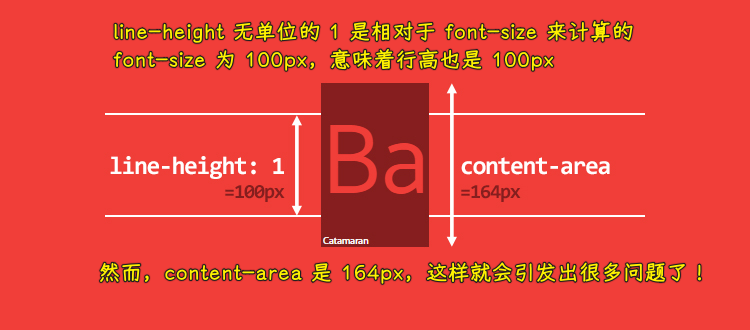

> 使用 `line-height: 1` 可以创建一个小于 context-area 的 line-box

然而，不仅仅是 `line-height:1` 有问题，值得一提的是，在我电脑上安装的 1117 款字体（是的，[我安装了来自 Google Web Fonts 里边的所有字体](https://github.com/qrpike/Web-Font-Load)），其中 1059 款字体，占全部字体的`95%`左右，计算的`line-height` 比 1 大，最低的有 0.618，最高的有 3.378。你没看错，是 3.378！

关于 line-box 计算的小细节：

* 对于内联元素，`padding` 和 `border` 会增大 background 区域，但是不会增大 content-area 的高度（不是 line-box 的高度）。因此，你在屏幕上看到的不一定就是内容区域。`margin-top` 和 `margin-bottom` 对内联元素没有作用。
* 对于可替换内联元素（replaced inline elements）,`inline-block` 元素和 blockified 内联元素：`padding`、`margin` 和 `border` 都会增大 `height`（译者注：注意 `margin`），所以 content-area 和 line-box 的高度也会有所增加

## vertical-align: one property to rule them all

> 一个属性控制一切

我还没提过 `vertical-align` 属性，尽管它是计算 line-box 高度的一个重要因素。我们甚至可以说 `vertical-align` 可能在内联格式化上下文（IFC）中起主导作用，也就是说它是 IFC 中最重要的属性。

它的默认值是 `baseline`。还记得字体度量里的 ascender 和 descender 吗？这些值决定了 baseline 的位置，也就是比例。很少有字体的 ascender 和 descender 之间的比例是一比一（`50/50`）的，所以我们经常会看到一些意想不到的现象，例如使用兄弟元素

从这段代码开始：

``` html
<p>
  <span>Ba</span> 
  <span>Ba</span>
</p>
```

``` css
p {
  font-family: Catamaran;
  font-size: 100px;
  line-height: 200px;
}
```

一个 `<p>` 标签内有两个`<span>` 标签，`<span>` 继承了 `font-family`、`font-size` 和 固定的 `200px` `line-height`。这时两个 span 的 baseline 是等高的，line-box 的高度就是 span 的 `line-height`。

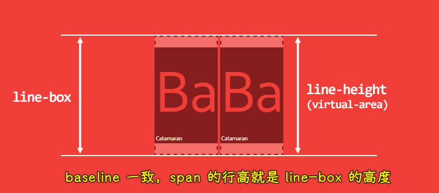

> 10. 相同的`font`值，相同的 baseline，一切看起来都很正常

如果第二个 `span` 的 `font-size` 更小了呢？

``` css
span:last-child {
  font-size: 50px;
}
```

这听起来很奇怪，但**默认的 baseline 对齐可能会导致 line-box 的高度变高了**！如下图所示。提示你一下，line-box 的高度是从其子元素的最高点计算到其子元素的最低点。

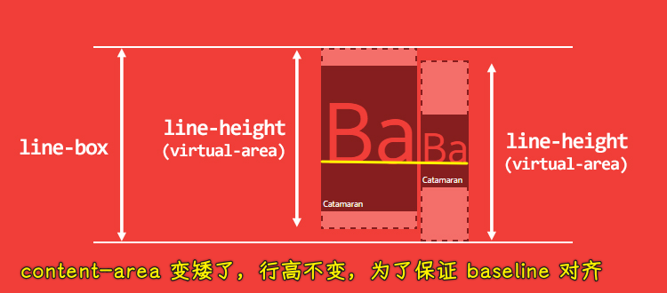

> 11. 较小的子元素可能导致较高的 line-box 高度

这个例子可以作为「[应该将 line-height 的值写成数字](http://allthingssmitty.com/2017/01/30/nope-nope-nope-line-height-is-unitless/)」的论据，但是有时候我们为了 [做出好看的垂直排版韵律感](https://scotch.io/tutorials/aesthetic-sass-3-typography-and-vertical-rhythm#baseline-grids-and-vertical-rhythm)，那你就必须把 `line-height` 写成一个固定值。**不过我实话告诉你吧，不管你把 `line-height` 写成什么，你都会在对齐内联元素的时候遇到麻烦。**

我们来看另一个例子。一个`<p>`标签有 `line-height:200px`，其中包含一个`<span>`，span 继承了 p 的 `line-height`。

``` html
<p>
  <span>Ba</span>
</p>
```

``` css
p {
  line-height: 200px;
}
span {
  font-family: Catamaran;
  font-size: 100px;
}
```

此时 line-box 的高度是多少呢？我们期望的是 `200px`，但我们得到的并不是。这里你没有考虑到的问题是 `p` 有自己的 `font-family`，默认值是 `serif`。p 的 baseline 和 span 的 baseline 位置可能不一样，因此最终的 line-box 比我们预想的要高一些。之所以会发生这种情况，是**因为浏览器在执行计算时，认为每个 line-box 的起始位置都有一个宽度为 0 的字符（zero-width character）**（CSS 文档规范将其称为 **strut**），并将其纳入 line-box 的高度的计算中。

> 看不见的字符，看得见的影响。

为了说明这个问题，我们正面临着与之前的兄弟元素相同的问题。

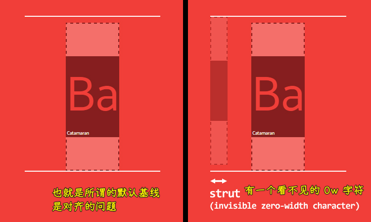

> 12. 每一个子元素都被对齐，就好像它的 line-box 以一个不可见的零宽度字符开始一样

用 baseline 来对齐令人费解，如果我们用 `vertical-align: middle` 会不会好一点呢？正如你在 CSS 文档规范中所看到的，`middle` 的意思是「用父元素 `baseline` 高度加上父元素中 `x-height` 的一半的高度来对齐当前元素的垂直方向的中点」。**由于 baseline 所处的高度跟字体有关，`x-height` 的高度也跟字体有关，所以 `middle` 对齐也不靠谱**。更糟糕的是，在大多数情况下，`middle` 根本就不是居中对齐！内联元素的对齐受太多因素影响了，使用 CSS 是不能设置这些因素的 (x-height, ascender/descender ratio，等）

顺便一说，`vertical-align` 的其他 4 个值在某些情况下可能会有点用：

* `vertical-align: top` / `bottom`，表示与 line-box 的顶部或底部对齐
* `vertical-align: text-top` / `text-bottom`，表示与 content-area 的顶部或底部对齐

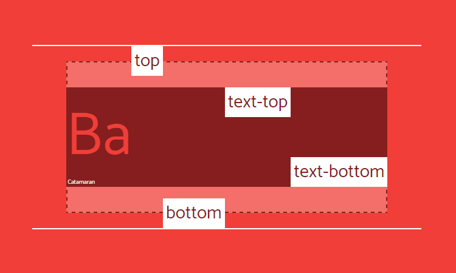

> 13. Vertical-align: top, bottom, text-top and text-bottom

不过你要小心，在任何情况下，它都会对齐 virtual-area，也就是一个不可见的高度。看看下面这个使用 `vertical-align:top` 的简单示例。**不可见的`line-height`可能会产生奇怪的结果，但这并不令人惊讶。**

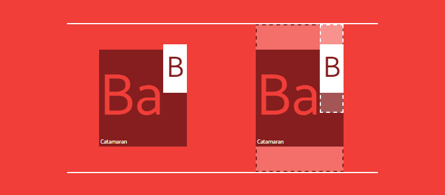

> 14. 垂直对齐一开始可能会产生奇怪的结果，但在可视化 line-height 时你会发现这是应该的！

最后，`vertical-align`还能接受数值，提高或降低盒子的基线，不到万不得已还是别用数字吧。

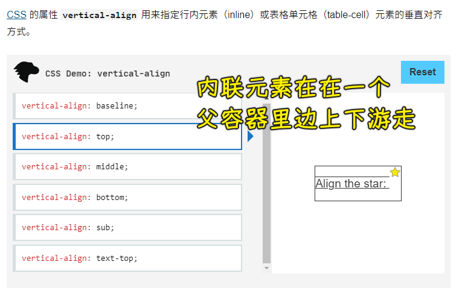

## CSS is awesome

我们已经讨论了 `line-height` 和 `vertical-align` 在一起是如何的，但现在问题的是：CSS 可以控制字体度量吗？简短的回答是：不行。我也很想用 CSS 来控制字体。无论怎样，我还是想试试。字体度量只是一些固定的值而已（constant，常量），我们应该可以围绕它做点什么。

比如说，我们想要一段使用 Catamaran 字体的文字，同时大写字母的高度正好是 100px，看起来可以实现，我们只需要一些数学知识。

首先我们把所有字体度量设置为 CSS 自定义属性（你也可以使用预处理器的变量，不需要自定义属性），然后计算出一个 `font-size`，让大写字母的高度正好是 `100px`。

``` css
p {
  /* font metrics */
  --font: Catamaran;
  --fm-capitalHeight: 0.68;
  --fm-descender: 0.54;
  --fm-ascender: 1.1;
  --fm-linegap: 0;

  /* desired font-size for capital height */
  --capital-height: 100;

  /* apply font-family */
  font-family: var(--font);

  /* compute font-size to get capital height equal desired font-size */
  --computedFontSize: (var(--capital-height) / var(--fm-capitalHeight));
  font-size: calc(var(--computedFontSize) * 1px);
}
```

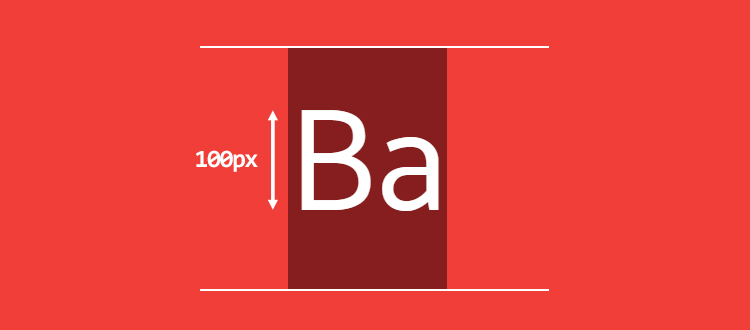

> 15. capital height 现在是 100px 高

看起来很简单，不是吗？但是如果我们想要文本在视觉上垂直居中呢？也就是让「B」字母上面的空间和下面的空间高度一样，这该咋整呢？为了做到这一点，我们必须要根据 ascender 和 descender 的比例来计算 `vertical-align`。

首先计算出 `line-height:normal` 的值和 content-area 的高度：

``` css
p {
  …
  --lineheightNormal: (var(--fm-ascender) + var(--fm-descender) + var(--fm-linegap));
  --contentArea: (var(--lineheightNormal) * var(--computedFontSize));
}
```

然后我们需要计算：

* B 下面空间的高度 -> 大写字母的底部到底部边缘的距离
* B 上面空间的高度 -> 大写字母的顶部到顶部边缘的距离

像这样：

``` css
p {
  …
  --distanceBottom: (var(--fm-descender));
  --distanceTop: (var(--fm-ascender) - var(--fm-capitalHeight));
}
```

现在我们就可以计算 `vertical-align` 的值了，B 的下空间距离与上空间距离之差，然后乘以大写字母的高度，最后减去`1px`（我们必须将此值应用于内联子元素）

``` css
p {
  …
  --valign: ((var(--distanceBottom) - var(--distanceTop)) * var(--computedFontSize));
}
span {
  vertical-align: calc(var(--valign) * -1px);
}
```

最后，我们设置所需的`line-height`并在保持垂直对齐的同时计算它：

``` css
p {
  …
  /* desired line-height */
  --line-height: 3;
  line-height: calc(((var(--line-height) * var(--capital-height)) - var(--valign)) * 1px);
}
```

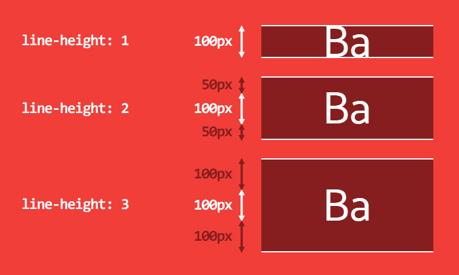

> 16. 不同 line-height 结果。文本总是在中间

添加一个和 `B` 一样高的 icon 现在就很容易了：

``` css
span::before {
  content: '';
  display: inline-block;
  width: calc(1px * var(--capital-height));
  height: calc(1px * var(--capital-height));
  margin-right: 10px;
  background: url('https://cdn.pbrd.co/images/yBAKn5bbv.png');
  background-size: cover;
}
```


> 17. Icon 和 B 字母有着相同的高度

[See result in JSBin](http://jsbin.com/tufatir/edit?css,output)

这个在线测试的图片失效了，本地测试情况：

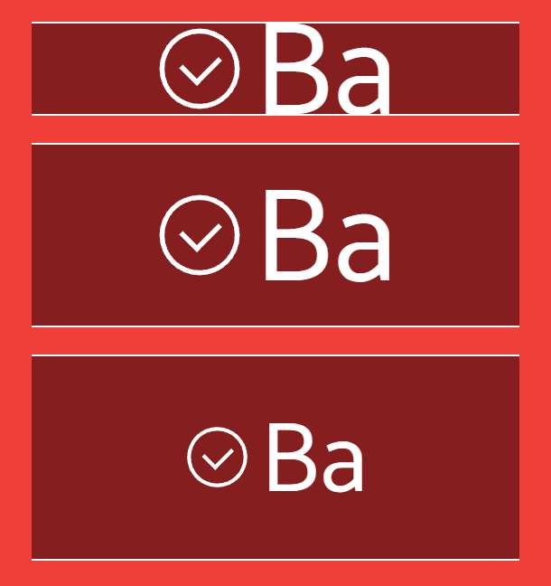

请注意，这个测试只是为了演示，请不要在生产环境中使用此方案。原因有很多：

- 除非字体度量是恒定的，否则 [浏览器中的计算就不是恒定的](https://www.brunildo.org/test/normal-lh-plot.html)
- 如果字体不加载，那备用字可能具有不同的字体度量，参数，并且处理多个值会很快变得非常难以管理

> `--`开头的，是 CSS 的原始变量，也被称之为 CSS 自定义属性

## Takeaways

我们学到了什么：

- IFC 真得很难理解
- 所有的内联元素都有两个高度
  * 基于字体度量的 content-area
  * virtual-area（也就是 `line-height` ）
  * 毫无疑问，这两个高度你都无法看到（如果你是 devtools 开发人员，并且希望开发这个工具，那么它会非常棒）
* `line-height: normal` 是基于字体度量计算出来的
* `line-height: n` (n=1,2,3…) 可能创建出一个比 content-area 还要矮的 virtual-area 
* `vertical-align` 不是很靠谱
* line-box 的高度是根据其子元素的 `line-height` 和` vertical-align` 计算得来的
* 我们无法轻易地用 CSS 来获取/设置（get/set）字体度量，也就是控制字体度量

但是我依然喜欢 CSS ：）

## Resources

- get font metrics: [FontForge](https://fontforge.github.io/en-US/), [opentype.js](http://opentype.js.org/font-inspector.html)
- [compute `line-height: normal`, and some ratio in the browser](http://brunildo.org/test/aspect-lh-table2.html)
- [Ahem](https://www.w3.org/Style/CSS/Test/Fonts/Ahem/), a special font to help understand how it works
- an even deeper, institutional, explanation of [inline formatting context](http://meyerweb.com/eric/css/inline-format.html)
- [Capsize](https://seek-oss.github.io/capsize/), a tool to make the sizing and layout of text predictable
- Up to date specification [CSS Inline Layout Module Level 3](https://drafts.csswg.org/css-inline-3/)
- [A blog post about the `leading-trim` property](https://medium.com/microsoft-design/leading-trim-the-future-of-digital-typesetting-d082d84b202), to ensure consistent spacing by controling the leading
- [Font Metrics API Level 1](https://drafts.css-houdini.org/font-metrics-api-1/), a collection of interesting ideas (Houdini)
