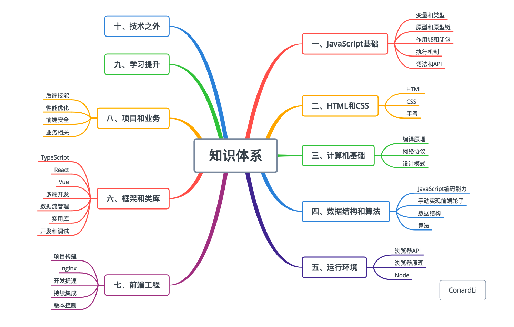

### ✍️ Tangxt ⏳ 2021-08-29 🏷️ FAQ

# FAQ

### <mark>1）前端知识体系来源？</mark>

➹：[【自检】前端知识清单 - ConardLi 的 blog](http://www.conardli.top/blog/article/%E7%BB%BC%E5%90%88/%E3%80%90%E8%87%AA%E6%A3%80%E3%80%91%E5%89%8D%E7%AB%AF%E7%9F%A5%E8%AF%86%E6%B8%85%E5%8D%95.html#%E5%BC%80%E7%AF%87)

### <mark>2）目录划分？</mark>

- 类似`JavaScript`这样的，单独开一个仓库，仓库里边都是「文章+视频」这样的输入来源，你要做的就是把这些输入给内化了……
- 输入源：课程（付费的视频课、付费的系列文章）、文章（他人写的优秀文章）、图书（纸质书、电子书）、教程（网上公开的免费视频和系列文章）

➹：[【知识管理】如何使用印象笔记的多级目录标签做知识分类管理？](https://www.yinxiang.com/everhub/note/40226bdd-6b3e-4bd5-aca1-8a18e584aa59)

➹：[吾好阅读](https://www.notion.so/skyao/29a1e7c4977f48f09ef2e7fcc4e49084)