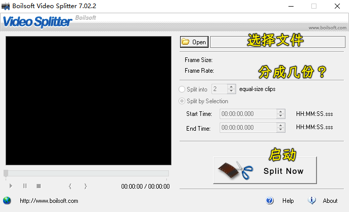
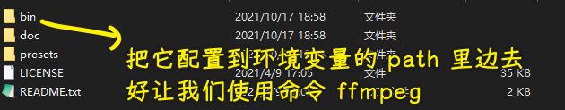
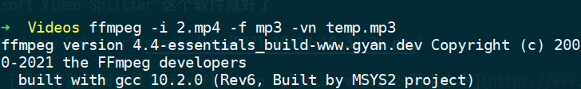

### ✍️ Tangxt ⏳ 2021-10-17 🏷️ How

# How

## ★Part1

### <mark>1）如何把一个视频直接分割成几段？</mark>

> 在使用飞书妙记的时候，如果视频太大了显然不好上传，所以我就切割成几份再上传了！

使用`Boilsoft Video Splitter`这个软件就好了



软件下载：[视频分割剪辑工具 Boilsoft Video Splitter v7.02.2-落尘之木](https://www.luochenzhimu.com/archives/2459.html) -> 提供了 key

➹：[视频剪辑，一部电影 90 分钟，我想把它剪成 10 份，每份 9 分钟，用什么软件，怎么操作？ - 推优创意的回答 - 知乎](https://www.zhihu.com/question/363966416/answer/957702151)

### <mark>2）如何直接把一个视频里的音频给提取出来？</mark>

> 在使用飞书妙记的时候，我一般上传的是教学视频，教学视频转成文字后，我不是线上校验的，而是把文字拷贝到本地，对着本地的这个教学视频来修正文字，所以我上传视频没用，还不如直接上传音频嘞！ -> 视频几乎比音频大 10 倍啊！

使用 FFmpeg 就好了！

下载 FFmpeg，然后配置系统环境变量，把`bin`文件路径放入`PATH`中：



使用（注意中文名的问题，最好还是用英文）：

``` bash
ffmpeg -i 2.mp4 -f mp3 -vn temp.mp3
```



`77.5 MB` -> `8.89 MB`

* `-i` 表示 input，即输入文件
* `-f` 表示 format，即输出格式
* `-vn`表示 vedio not，即输出不包含视频

➹：[怎么把视频里面的音频单独剪出来？ - 李超的回答 - 知乎](https://www.zhihu.com/question/484799567/answer/2116197694)

➹：[Windows 安装 ffmpeg 并从视频中提取音频_大葱敏的博客-CSDN 博客](https://blog.csdn.net/csm201314/article/details/83247566)

---

### <mark>3）在 git push 的时候报错了？</mark>

``` txt
kex_exchange_identification: Connection closed by remote host
Connection closed by 13.229.188.59 port 22
fatal: Could not read from remote repository.  
```

配置了代理也不行

如何解决？

在`.ssh`目录下创建一个`config`文件，添加以下配置：

``` txt
Host github.com
User xxx@gmail.com
Hostname ssh.github.com
PreferredAuthentications publickey
IdentityFile ~/.ssh/id_rsa
Port 443
```

➹：[GitHub 上传踩坑与问题解决_Redfieldw 的博客-CSDN 博客](https://blog.csdn.net/qq_40328147/article/details/119619632)

➹：[SSH Config 那些你所知道和不知道的事 - Deepzz's Blog](https://deepzz.com/post/how-to-setup-ssh-config.html)

### <mark>4）`.gitignore` 规则不生效？</mark>

在项目开发过程中，一般都会添加 `.gitignore` 文件，规则很简单，但有时会发现，规则不生效。

原因是 `.gitignore` 只能忽略那些原来没有被 `track` 的文件，如果某些文件已经被纳入了版本管理中，则修改 `.gitignore` 是无效的。

那么解决方法就是先把本地缓存删除（改变成未 `track` 状态），然后再提交。

``` bash
git rm -r --cached .
git add .
git commit -m 'update .gitignore'
```

你不想再提交这个`faq.md`了，但之前你已经提交过了，此时你先把这个`faq.md`给删了，然后提交到远程仓库中 -> 接着把本地缓存删除，把`faq.md`再添加回来 -> 此时`.gitignore`就生效了！
