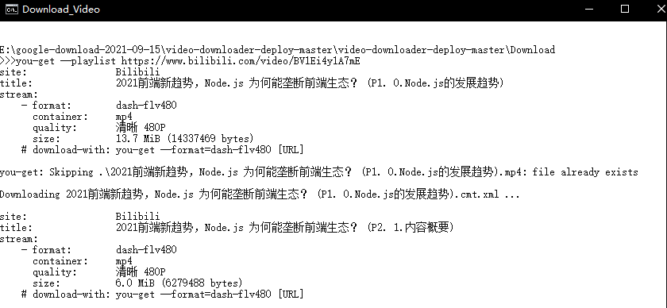
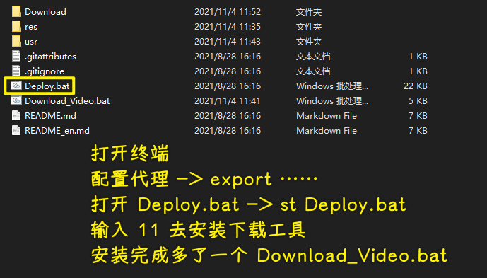
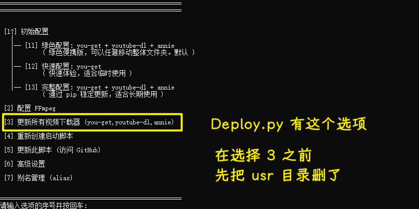

### ✍️ Tangxt ⏳ 2021-10-17 🏷️ How

# How

## ★Part1

### <mark>1）如何把一个视频直接分割成几段？</mark>

> 在使用飞书妙记的时候，如果视频太大了显然不好上传，所以我就切割成几份再上传了！

使用`Boilsoft Video Splitter`这个软件就好了


软件下载：[视频分割剪辑工具 Boilsoft Video Splitter v7.02.2-落尘之木](https://www.luochenzhimu.com/archives/2459.html) -> 提供了 key

➹：[视频剪辑，一部电影 90 分钟，我想把它剪成 10 份，每份 9 分钟，用什么软件，怎么操作？ - 推优创意的回答 - 知乎](https://www.zhihu.com/question/363966416/answer/957702151)

### <mark>2）如何直接把一个视频里的音频给提取出来？</mark>

> 在使用飞书妙记的时候，我一般上传的是教学视频，教学视频转成文字后，我不是线上校验的，而是把文字拷贝到本地，对着本地的这个教学视频来修正文字，所以我上传视频没用，还不如直接上传音频嘞！ -> 视频几乎比音频大 10 倍啊！

使用 FFmpeg 就好了！

下载 FFmpeg，然后配置系统环境变量，把`bin`文件路径放入`PATH`中：


使用（注意中文名的问题，最好还是用英文）：

``` bash
ffmpeg -i 2.mp4 -f mp3 -vn temp.mp3
```


`77.5 MB` -> `8.89 MB`

* `-i` 表示 input，即输入文件
* `-f` 表示 format，即输出格式
* `-vn`表示 vedio not，即输出不包含视频

➹：[怎么把视频里面的音频单独剪出来？ - 李超的回答 - 知乎](https://www.zhihu.com/question/484799567/answer/2116197694)

➹：[Windows 安装 ffmpeg 并从视频中提取音频_大葱敏的博客-CSDN 博客](https://blog.csdn.net/csm201314/article/details/83247566)

---

### <mark>3）在 git push 的时候报错了？</mark>

``` js
kex_exchange_identification: Connection closed by remote host
Connection closed by 13.229.188.59 port 22
fatal: Could not read from remote repository.  
```

配置了代理也不行

如何解决？

在`.ssh`目录下创建一个`config`文件，添加以下配置：

``` js
Host github.com
User xxx@gmail.com
Hostname ssh.github.com
PreferredAuthentications publickey
IdentityFile ~/.ssh/id_rsa
Port 443
```

➹：[GitHub 上传踩坑与问题解决_Redfieldw 的博客-CSDN 博客](https://blog.csdn.net/qq_40328147/article/details/119619632)

➹：[SSH Config 那些你所知道和不知道的事 - Deepzz's Blog](https://deepzz.com/post/how-to-setup-ssh-config.html)

### <mark>4）`.gitignore` 规则不生效？</mark>

在项目开发过程中，一般都会添加 `.gitignore` 文件，规则很简单，但有时会发现，规则不生效。

原因是 `.gitignore` 只能忽略那些原来没有被 `track` 的文件，如果某些文件已经被纳入了版本管理中，则修改 `.gitignore` 是无效的。

那么解决方法就是先把本地缓存删除（改变成未 `track` 状态），然后再提交。

``` bash
git rm -r --cached .
git add .
git commit -m 'update .gitignore'
```

你不想再提交这个`faq.md`了，但之前你已经提交过了，此时你先把这个`faq.md`给删了，然后提交到远程仓库中 -> 接着把本地缓存删除，把`faq.md`再添加回来 -> 此时`.gitignore`就生效了！

### <mark>5）如何批量下载 B 站视频？</mark>

> 如果是单个视频，我就去第三方的网站输入视频地址，然后下载了！

用 `you-get` 就好了



通过下边这个工具去安装`you-get`：

[LussacZheng/video-downloader-deploy: Video Downloaders (you-get, youtube-dl, annie) One-Click Deployment Batch. 视频下载器 (you-get, youtube-dl, annie) 一键配置脚本。](https://github.com/LussacZheng/video-downloader-deploy)



我是在`you-get`更新之前的几小时下载的，所以我起初下载了一个`0.4.1545`版本 -> 结果该版本不能下载 B 站的视频

于是我去了官网，发现它已经更新了，有了一个`0.4.1555`版本：


那我该如何更新呢？



一些 `you-get` 的参数：

``` js
-l 网址                # 批量下载这个网址下的所有视频
-c 浏览器的cookies文件  # 通过浏览器的 cookies 可以下载会员才能看的视频
--no-caption          # 不下载字幕文件
-O 保存的文件名         # 在仅下载一个文件时指定文件名
-o 保存的目录           # 指定下载的文件保存的目录
```

---

小结：

`0.4.4545`版本我测试了一下可以下载资源，但是 B 站的就不行了，我尝试过用 `you-get https://www.bilibili.com/video/av`+`aid`的姿势、也试过什么加双引号之类的，结果都不行 -> 猜测会有版本更新 -> 于是就去更新了`you-get` -> 再次下载 B 站视频，ok！

➹：[soimort/you-get: Dumb downloader that scrapes the web](https://github.com/soimort/you-get)

➹：[如何批量下载bilibili的视频？ - zhtz的回答 - 知乎](https://www.zhihu.com/question/49793759/answer/269381987)

### <mark>6）如何为终端临时配置代理？</mark>

直接在终端执行这个：

``` bash
export http_proxy=http://127.0.0.1:1080;export https_proxy=http://127.0.0.1:1080;
```

之后，在这个终端的操作，都会走这个临时代理！ -> 终端关闭了，意味着这个代理没了！ -> 再用的话，那就再打开终端，再执行上边的代理配置
