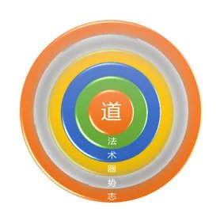

### ✍️ Tangxt ⏳ 2021-09-15 🏷️ Work

> 原文：[两年后端研发工作经验分享_工作以后_牛客网](https://www.nowcoder.com/discuss/351805?page=4)

# 两年后端研发工作经验分享

先简单交代一下背景吧，某不知名 985 的本硕，17 年毕业加入 [滴滴](https://www.nowcoder.com/jump/super-jump/word?word=%E6%BB%B4%E6%BB%B4)，当时找工作时候也是在 [牛客](https://www.nowcoder.com/jump/super-jump/word?word=%E7%89%9B%E5%AE%A2) 这里跟大家一起奋战的。今年下半年跳槽到了头条，一直从事后端研发相关的工作。之前没有实习经历，算是两年半的工作经验吧。这两年半之间完成了一次晋升，换了一家公司，有过开心满足的时光，也有过迷茫挣扎的日子，不过还算顺利地从一只职场小菜鸟转变为了一名资深划水员。在这个过程中，总结出了一些还算实用的划水经验，有些是自己领悟到的，有些是跟别人交流学到的，在这里跟大家分享一下。

## 学会深入思考，总结沉淀
‌
我想说的第一条就是要学会深入思考，总结沉淀，这是我觉得最重要也是最有意义的一件事。

‌
先来说深入思考。在程序员这个圈子里，常能听到一些言论：我这个工作一点技术含量都没有，每天就 CRUD，再写写 if-else，这 TM 能让我学到什么东西？抛开一部分调侃和戏谑的论调不谈，这可能确实是一部分同学的真实想法，至少曾经的我，就这么认为过。后来随着工作经验的积累，加上和一些高 level 的同学交流探讨之后，我发现这个想法其实是非常错误的。之所以出现没什么可学的这样的看法，基本上是思维懒惰的结果。任何一件看起来很不起眼的小事，只要进行深入思考，稍微纵向挖深或者横向拓宽一下，都是足以让人沉溺的知识海洋。

‌
举一个例子。某次有个同学跟我说，这周有个服务 OOM 了，查了一周发现有个地方 defer 写的有问题，改了几行代码上线修复了，周报都没法写。可能大家也遇到过这样的场景，还算是有一定的代表性。其实就查 bug 这件事来说，是一个发现问题，排查问题，解决问题的过程，包含了触发、定位、复现、根因、修复、复盘等诸多步骤，花了一周来做这件事，一定有不断尝试与纠错的过程，这里面其实就有很多思考的空间。比如说定位，如何缩小范围的？走了哪些弯路？用了哪些分析工具？比如说根因，可以研究的点起码有 linux 的 OOM，k8s 的 OOM，go 的内存管理，defer 机制，函数闭包的原理等等。如果这些真的都不涉及，仍然花了一周时间做这件事，那复盘应该会有很多思考，提出来几十个 WHY 没问题吧。..

‌
再来说下总结沉淀。这个我觉得也是大多数程序员比较欠缺的地方，只顾埋头干活，可以把一件事做的很好。但是几乎从来不做抽象总结，以至于工作好几年了，所掌握的知识还是零星的几点，不成体系，不仅容易遗忘，而且造成自己视野比较窄，看问题比较局限。适时地做一些总结沉淀是很重要的，这是一个从术到道的过程，会让自己看问题的角度更广，层次更高。遇到同类型的问题，可以按照总结好的方法论，系统化、层次化地推进和解决。

‌
还是举一个例子。做后台服务，今天优化了 1G 内存，明天优化了 50%的读写耗时，是不是可以做一下性能优化的总结？比如说在应用层，可以管理服务对接的应用方，梳理他们访问的合理性；在架构层，可以做缓存、预处理、读写分离、异步、并行等等；在代码层，可以做的事情更多了，资源池化、对象复用、无锁化设计、大 key 拆分、延迟处理、编码压缩、gc 调优还有各种语言相关的高性能实践。.. 等下次再遇到需要性能优化的场景，一整套思路立马就能套用过来了，剩下的就是工具和实操的事儿了。

‌
还有的同学说了，我就每天跟 PM 撕撕逼，做做需求，也不做性能优化啊。先不讨论是否可以搞性能优化，单就做业务需求来讲，也有可以总结的地方。比如说，如何做系统建设？系统核心能力，系统边界，系统瓶颈，服务分层拆分，服务治理这些问题有思考过吗？每天跟 PM 讨论需求，那作为技术同学该如何培养产品思维，引导产品走向，如何做到架构先行于业务，这些问题也是可以思考和总结的吧。就想一下，连接手维护别人烂代码这种蛋疼的事情，都能让 Martin Fowler 整出来一套重构理论，还显得那么高大上，我们确实也没啥必要对自己的工作妄自菲薄。..

‌
所以说学习和成长是一个自驱的过程，如果觉得没什么可学的，大概率并不是真的没什么可学的，而是因为自己太懒了，不仅是行动上太懒了，思维上也太懒了。

‌
> 可以多写技术文章，多分享，强迫自己去思考和总结，毕竟如果文章深度不够，大家也不好意思公开分享。

## 积极学习，保持技术热情
‌
最近两年在互联网圈里广泛传播的一种焦虑论叫做 35 岁程序员现象，大意是说程序员这个行业干到 35 岁就基本等着被裁员了。不可否认，互联网行业在这一点上确实不如公务员等体制内职业。但是这个问题里 35 岁程序员并不是绝对生理意义上的 35 岁，应该是指那些工作十几年和工作两三年没什么太大区别的程序员。后面的工作基本是在吃老本，没有主动学习与充电，35 岁和 25 岁差不多，而且没有了 25 岁时对学习成长的渴望，反而添了家庭生活的诸多琐事，薪资要求往往也较高，在企业看来这确实是没什么竞争力。

‌
而如果我们积极学习，保持技术能力、知识储备与工作年限成正比，这到了 35 岁哪还有什么焦虑呢，这样的大牛我觉得应该也是各大公司抢着要吧？但是学习这件事，其实是一个反人类的过程，这就需要我们强迫自己跳出自己的安逸区，主动学习，保持技术热情。在滴滴时有一句话大概是，主动跳出自己的舒适区，感到挣扎与压力的时候，往往是黎明前的黑暗，那才是成长最快的时候。相反如果感觉自己每天都过得很安逸，工作只是在混时长，那可能真的是温水煮青蛙了。

‌
刚毕业的这段时间，往往空闲时间还比较多，正是努力学习技术的好时候。借助这段时间夯实基础，培养出良好的学习习惯，保持积极的学习态度，应该是受益终身的。至于如何高效率学习，网上有很多大牛写这样的帖子，到了公司后内网也能找到很多这样的分享，我就不多谈了。

‌
> 可以加入学习小组和技术社区，公司内和公司外的都可以，关注前沿技术。

‌
## 主动承担，及时交流反馈
‌
前两条还是从个人的角度出发来说的，希望大家可以提升个人能力，保持核心竞争力，但从公司角度来讲，公司招聘员工入职，最重要的是让员工创造出业务价值，为公司服务。虽然对于校招生一般都会有一定的培养体系，但实际上公司确实没有帮助我们成长的义务。而在能为公司办成事，创造价值这一点上，我觉得最重要的两个字就是主动，主动承担任务，主动沟通交流，主动推动 [项目](https://www.nowcoder.com/jump/super-jump/word?word=%E9%A1%B9%E7%9B%AE) 进展，主动协调资源，主动向上反馈，主动创造影响力等等。我当初刚入职的时候，基本就是 leader 给分配什么任务就把本职工作做好，然后就干自己的事了，几乎从来不主动去跟别人交流或者主动去思考些能帮助项目发展的点子。自以为把本职工作保质保量完成就行了，后来发现这么做其实是非常不够的，这只是最基本的要求。而有些同学的做法则是 leader 只需要同步一下最近要做什么方向，下面的一系列事情基本不需要 leader 操心了 ，这样的同学我是 leader 我也喜欢啊。入职后经常会听到的一个词叫 owner 意识，大概就是这个意思吧。

‌
在这个过程中，另外很重要的一点就是及时向上沟通反馈。项目进展不顺利，遇到什么问题，及时跟 leader 同步，技术方案拿捏不准可以跟 leader 探讨，一些资源协调不了可以找 leader 帮忙，不要有太多顾忌，认为这些会太麻烦，leader 其实就是干这个事的。如果项目进展比较顺利，确实也不需要 leader 介入，那也需要及时把项目的进度，取得的收益及时反馈，自己有什么想法也提出来探讨，问问 leader 对当前进展的建议，还有哪些地方需要改进，消除信息误差。做这些事一方面是合理利用 leader 的各种资源，另一方面也可以让 leader 了解到自己的工作量，对项目整体有所把控，毕竟 leader 也有 leader，也是要汇报的。可能算是大家比较反感的向上管理吧，有内味了，这个其实我也做得不好。但是最基本的一点，不要接了一个任务闷着头干活甚至与世隔绝了，一个月了也没跟 leader 同步过，想着憋个大招之类的，那基本凉凉。

‌
> 一定要主动，可以先从强迫自己在各种公开场合发言开始，有问题或想法及时 one-one。

‌
除了以上几点，还有一些小点我觉得也是比较重要的，列在下面：

## 第一件事建立信任
‌
无论是校招还是社招，刚入职的第一件事是非常重要的，直接决定了 leader 和同事对自己的第一印象。入职后要做的第一件事一定要做好，最起码的要顺利完成而且不能出线上事故。这件事的目的就是为了建立信任，让团队觉得自己起码是靠谱的。如果这件事做得比较好，后面一路都会比较顺利。如果这件事就搞杂了，可能有的 leader 还会给第二次机会，再搞不好，后面就很难了，这一条对于社招来说更为重要。

‌
而刚入职，公司技术栈不熟练，业务繁杂很难理清什么头绪，压力确实比较大。这时候一方面需要自己投入更多的精力，另一方面要多跟组内的同学交流，不懂就问。最有效率的学习方式，我觉得不是什么看书啊学习视频啊，而是直接去找对应的人聊，让别人讲一遍自己基本就全懂了，这效率比看文档看代码快多了，不仅省去了过滤无用信息的过程，还了解到了业务的演变历史。当然，这需要一定的沟通技巧，毕竟同事们也都很忙。

‌
> 脸皮要厚一点，多找人聊，快速融入，最忌讳有问题也不说，自己把自己孤立起来。

‌
## 超出预期
‌
超出预期这个词的外延范围很广，比如 leader 让去做个值周，解答用户群里大家的问题，结果不仅解答了大家的问题，还收集了这些问题进行分类，进而做了一个智能问答机器人解放了值周的人力，这可以算超出预期。比如 leader 让给运营做一个小工具，结果建设了一系列的工具甚至发展成了一个平台，成为了一个完整的项目，这也算超出预期。超出预期要求我们有把事情做大的能力，也就是想到了 leader 没想到的地方，并且创造了实际价值，拿到了业务收益。这个能力其实也比较重要，在工作中发现，有的人能把一个小盘子越做越大，而有的人恰好反之，那么那些有创新能力，经常超出预期的同学发展空间显然就更大一点。

‌
> 这块其实比较看个人能力，暂时没想到什么太好的捷径，多想一步吧。

‌
## 体系化思考，系统化建设
‌
这句话是晋升时候总结出来的，大意就是做系统建设要有全局视野，不要局限于某一个小点，应该有良好的规划能力和清晰的演进蓝图。比如，今天加了一个监控，明天加一个报警，这些事不应该成为一个个孤岛，而是属于稳定性建设一期其中的一小步。这一期稳定性建设要做的工作是报警配置和监控梳理，包括机器监控、系统监控、业务监控、数据监控等，预期能拿到 XXX 的收益。这个工作还有后续的 roadmap，稳定性建设二期要做容量规划，接入压测，三期要做降级演练，多活容灾，四期要做。.. 给人的感觉就是这个人思考非常全面，办事有体系有规划。

‌
> 平时积极总结沉淀，多跟别人交流，形成方法论。

‌
## 提升自己的软素质能力
‌
这里的软素质能力其实想说的就是 PPT、沟通、表达、时间管理、设计、文档等方面的能力。说实话，我觉得我当时能晋升就是因为 PPT 做的好了一点。.. 可能大家平时对这些能力都不怎么关注，以前我也不重视，觉得比较简单，用时候直接上就行了，但事实可能并不像想象得那样简单。比如晋升时候 PPT+演讲+答辩这个工作，其实有很多细节的思考在里面，内容如何选取，排版怎么设计，怎样引导听众的情绪，如何回答评委的问题等等。晋升时候我见过很多同学 PPT 内容编排杂乱无章，演讲过程也不流畅自然，虽然确实做了很多实际工作，但在表达上欠缺了很多，属于会做不会说，如果再遇到不了解实际情况的外部门评委，吃亏是可以预见的。

‌
> 公司内网一般都会有一些软素质培训课程，可以找一些场合刻意训练。

‌
以上都是这些分享还都算比较伟光正，但是社会吧也不全是那么美好的。下面这些内容有负能量倾向，三观特别正的同学以及观感不适者建议跳过。

## 拍马屁是真的香
‌
拍马屁这东西入职前我是很反感的，我最初想加入互联网公司的原因就是觉得互联网公司的人情世故没那么多，事实证明，我错了。.. 入职前几天，部门群里大 leader 发了一条消息，后面几十条带着大拇指的消息立马跟上，学习了，点赞，真不错，优秀，那场面，说是红旗招展锣鼓喧天鞭炮齐鸣一点也不过分。除了惊叹大家超强的信息接收能力和处理速度外，更进一步我还发现，连拍马屁都是有队形的，一级部门 leader 发消息，几个二级部门 leader 跟上，后面各组长跟上，最后是大家的狂欢，让我一度怀疑拍马屁的速度就决定了职业生涯的发展前景（没错，现在我已经不怀疑了）。

‌
坦诚地说，我到现在也没习惯在群里拍马屁，但也不反感了，可以说把这个事当成一乐了。倒不是说我没有那个口才和能力（事实上也不需要什么口才，大家都简单直接），在某些场合，为活跃气氛的需要，我也能小嘴儿抹了蜜，甚至能把古诗文彩虹屁给 leader 安排上。而是我发现我的直属 leader 也不怎么在群里拍马屁，所以我表面上不公开拍马屁其实属于暗地里事实上迎合了 leader 的喜好。..

‌
但是拍马屁这个事只要掌握好度，整体来说还是香的，最多是没用，至少不会有什么坏处嘛。大家能力都差不多，每一次在群里拍马屁的机会就是一次露脸的机会，按某个同事的说法，这就叫打造个人技术影响力。..

‌
> 想舔就舔，不想舔也没必要酸别人，Respect Greatness。

## 永不缺席的撕逼甩锅实战
‌
有人的地方，就有江湖。虽然搞技术的大多城府也不深，但撕逼甩锅邀功抢活这些闹心的事儿基本也不会缺席，甚至我还见到过公开群发邮件撕逼的。.. 这部分话题涉及到一些敏感信息就不多说了，而且我们低职级的遇到这些事儿的机会也不会太多。只是给大家提个醒，在工作的时候迟早都会吃到这方面的瓜，到时候留个心眼。

‌
> 稍微注意一下，咱不会去欺负别人，但也不能轻易让别人给欺负了。

‌
## 不要被画饼蒙蔽了双眼
‌
说实话，我个人是比较反感灌鸡汤、打鸡血、谈梦想、讲奋斗这一类行为的，9102 年都快过完了，这一套***治还在大行其道，真不知道是该可笑还是可悲。当然，这些词本身并没有什么问题，但是这些东西应该是自驱的，而不应该成为外界的一种强 push。『我必须努力奋斗』这个句式我觉得是正常的，但是『你必须努力奋斗』这种话多少感觉有点诡异，努力奋斗所以让公司的股东们发家致富？尤其在钱没给够的情况下，这些行为无异于耍流氓。我们需要对 leader 的这些画饼操作保持清醒的认知，理性分析，作出决策。比如感觉钱没给够（或者职级太低，同理）的时候，可能有以下几种情况：

‌
1. leader 并没有注意到你薪资较低这一事实
2. leader 知道这个事实，但是不知道你有多强烈的涨薪需求
3. leader 知道你有涨薪的需求，但他觉得你能力还不够
4. leader 知道你有涨薪的需求，能力也够，但是他不想给你涨
5. leader 想给你涨，也向上反馈和争取了，但是没有资源

‌
这时候我们需要做的是向上反馈，跟 leader 沟通确认。如果是 1 和 2，那么通过沟通可以消除信息误差。如果是 3，需要分情况讨论。如果是 4 和 5，已经可以考虑撤退了。对于这些事儿，也没必要抱怨，抱怨解决不了任何问题。我们要做的就是努力提升好个人能力，保持个人竞争力，等一个合适的时机，跳槽就完事了。

‌
> 时刻准备着，技术在手就没什么可怕的，哪天干得不爽了直接跳槽。

‌
## 学会包装
‌
这一条说白了就是，要会吹。忘了从哪儿看到的了，能说、会写、善做是对职场人的三大要求。能说是很重要的，能说才能要来项目，拉来资源，招来人。同样一件事，不同的人能说出来完全不一样的效果。比如我做了个小工具上线了，我就只能说出来基本事实，而让 leader 描述一下，这就成了，打造了 XXX 的工具抓手，改进了 XXX 的完整生态，形成了 XXX 的业务闭环。老哥，我服了，硬币全给你还不行嘛。据我的观察，每个互联网公司都有这么几个词，抓手、生态、闭环、拉齐、梳理、迭代、owner 意识等等等等，我们需要做的就是熟读并背诵全文，啊不，是牢记并熟练使用。

‌
这是对事情的包装，对人的包装也是一样的，尤其是在晋升和面试这样的应试型场合，特点是流程短一锤子买卖，包装显得尤为重要。晋升和面试这里就不展开说了，这里面的道和术太多了。下面的场景提炼自面试过程中和某公司面试官的谈话，大家可以感受一下：

‌
* 我们背后是一个四五百亿美金的市场。..
* 我负责过每天千亿级别访问量的系统。..
* 工作两年能达到这个程度挺不错的。..
* 贵司技术氛围挺好的，业务发展前景也很广阔。..
* 啊，彼此彼此。..
* 嗯，久仰久仰。..

‌
人生如戏，全靠演技

> 可以多看 leader 的 PPT，多听老板的向上汇报和宣讲会。

‌
## 选择和努力哪个更重要？
‌
这还用问么，当然是选择。在完 [美的](https://www.nowcoder.com/jump/super-jump/word?word=%E7%BE%8E%E7%9A%84) 选择面前，努力显得一文不值，我有个多年没联系的高中同学今年已经在时代广场敲钟了。.. 但是这样的案例太少了，做出完美选择的随机成本太高，不确定性太大。对于大多数刚毕业的同学，对行业的判断力还不够成熟，对自身能力和创业难度把握得也不够精准，此时拉几个人去创业，显得风险太高。我觉得更为稳妥的一条路是，先加入规模稍大一点的公司，找一个好 leader，抱好大腿，提升自己的个人能力。好平台加上大腿，再加上个人努力，这个起飞速度已经可以了。等后面积累了一定人脉和资金，深刻理解了市场和需求，对自己有信心了，可以再去考虑创业的事。

‌
> 如果对自己没太大自信的话，那就来头条一起抱团取暖吧，记住找我内推

本来还想分享一些生活方面的故事，发现已经这么长了，那就先这样叭。上面写的一些总结和建议我自己做的也不是很好，还需要继续加油，和大家共勉。另外，其中某些观点，由于个人视角的局限性也不保证是普适和正确的，可能再工作几年这些观点也会发生改变，欢迎大家跟我交流~（甩锅成功）

‌
最后祝大家都能找到心仪的工作，快乐工作，幸福生活，广阔天地，大有作为。

## 评论

- 文章作者：自己读了一遍发现结论性的东西有点多，缺少一些有意思的心路变化历程，读起来比较干，大家凑合看。
- 写的非常好，好几个点都在实习过程中见识到了
- 你业余时间有培养刷题的习惯吗？
  - 基本没有刷题的习惯，偶尔有朋友面试回来交流些面试题，会想想怎么实现的。平时关注的一般都是比较实用的技术，刷题基本是面试前稍微准备了一点，没有太刻意练习。校招的话可以多刷点题。
- 18 届的深有同感，把我心声都说出来了
- 大佬是用啥开发语言？
  - 工作之前基本是 java，工作之后 go 为主，其他的需要用到啥就学啥。..
- 后面几条过于真实
- 楼主跳槽的原因是？
  - 1. 简单点说，钱没给够。2. leader 走了，作为他的嫡系，我感觉到了压力。3. 感觉每天的工作挑战不大了，活水又涨不了薪。4. 和我一届的朋友基本快走完了。..
    - “和我一届的朋友基本快走完了” 流动这么快吗
      - 可能是因为我的朋友都不太安分。
- 公司招人就是来解决问题的，会来事很重要。会总结，会沟通，会把平平无奇的东西上价值更重要。
  - 深有同感
- 语文好是真的有用
  - 到位（十分准确）
- 拍马屁写得太真实了，实习时钉钉里部门大群的信息大半都是点赞，刚开始还觉得这些人总是发这些无用信息干嘛，后来自己也跟着无脑点赞，现在仔细回想拍马屁还真是有队形的
- 前辈我想问一下，我原来是后端开发，校招拿到一个大厂大数据平台开发岗与二线厂后端开发岗，应该选哪个呢？大数据开发的技术栈好像和后端不太一样，以后还能转回后端吗？
  - 技术栈是有一些区别的，不过想转回后端，应该也没啥阻力，后端这个概念也挺大的。比如想换个语言啊，做中台的想去做业务啊，这种都很正常。至于选哪个这信息太少了，我也不好轻易给你个结论。
    - 前辈，大数据平台开发那个 offer 主要技术栈是 Hadoop 全家桶，然后开发离线和实时的大数据平台，感觉基本和 web、微服务、缓存这块也没关系了。我现在看了下求职网站，发现大数据开发的 hc 远远比后端要少，所以感觉后端的前景肯定比大数据好，如果我接了这个大数据的 offer，如果以后我要社招想转回后端写 crud 会不会很难啊？毕竟大数据和后端的技术栈也不太相似？又或者是放弃这个大厂的 offer，去二线厂做后端开发呢？
      - 如果你只是纠结于大数据岗转后端不好转，大数据岗前景不好的话，我觉得没有必要。首先，我觉得大数据岗前景挺好的，现在谈什么数据驱动，精细化运营，AI 等等都需要强大的数据能力，数据层的东西很重要。至于大数据 hc 比后端少，这个也很正常，业务需求复杂多变，各领域差异较大，而大数据这种偏基础架构的相对通用性高一点。第二个，大数据转后端会不会很难，我觉得没啥难的，身边基础架构转业务，业务转基础架构，业务转算法都有，甚至前端转后端，研发转 PM 都有，工作前几年可塑性是很强的，不用担心。个人意见哈，仅供参考。
- 很多时候确实选择比努力重要得多，方向对了，猪都可以起飞
- 读这种好文，有如沐春风之感

很好，实习时候有体会。

1. 第一印象很重要。
2. 性格不管什么样，工作态度一定要积极
3. 一定要主动沟通，及时反馈
4. 书面表达能力也很重要，例如在内网写技术文章

## Q&A

### <mark>1）值周？</mark>

值周就是学校或班级为学生安排一些任务，期限为一星期或以上。在这期间就叫做值周。

> 简单来说，就是完成这周给你安排的一些任务

### <mark>2）one-one？</mark>

跟 leader 一对一问问？

one-on-one：（通常指一人教另一人或给予另一人资讯）一对一的

Each employee has a one-on-one performance review with his or her boss.

➹：[one-on-one 中文（简体）翻译：剑桥词典](https://dictionary.cambridge.org/zhs/%E8%AF%8D%E5%85%B8/%E8%8B%B1%E8%AF%AD-%E6%B1%89%E8%AF%AD-%E7%AE%80%E4%BD%93/one-on-one)

### <mark>3）向上管理</mark>

虽然你是我的 leader，但我也要资格管你？

➹：[向上管理怎么做？ - 知乎](https://www.zhihu.com/question/39854128)

### <mark>4）owner 意识？</mark>

> 有意识的让自己为结果负责

- 工作负责
- 工作主动

➹：[对产品实习生来说，如何培养 owner 意识 - 人人都是产品经理](http://www.woshipm.com/pmd/4105397.html)

➹：[论工程师的 Owner 意识 - 简书](https://www.jianshu.com/p/a94137a92cba)

➹：[成员的 owner 意识_十一点钟_新浪博客](http://blog.sina.com.cn/s/blog_77e567c901017ptd.html)

➹：[Owner 漫画-短篇](https://www.tuhmh.com/chapter/17631/558729.html)

➹：[谈谈 ownership - 知乎](https://zhuanlan.zhihu.com/p/32309892)

➹：[工程师一定要有 “Owner 意识”_禅与计算机程序设计艺术-CSDN 博客](https://blog.csdn.net/universsky2015/article/details/106297858)

### <mark>5）术与道</mark>

“道”指的是抽象的、不实用的规律。而“术”呢是一些实操的技能？

“术”就是看你能驱动什么，而“道”呢就是看你在被什么东西驱动？

它们的区别不在于抽象还是具体，务虚还是实用，而是以人为分界线的。

整个世界中，人能够努力、能改变的那部分，那就是“术”。而人必须认同、必须遵循的那部分，那就是“道”。

这正好契合那句著名的话：

> 知道什么东西不能改变，这是平和；知道什么东西可以改变，这是勇气。

而知道二者之间的分别，这就是智慧啊。有“道”，有“术”，还有智慧啊。

---

- 道：就是核心思想、理念、本质规律。很多时候有人纠结是自然规律，还是人定的思想，其实王阳明早说了“天理即人心”，我说“天理因人而存在”。这六个字，完全是因为人类存在而存在的，包括外星人。
- 法：就是法律、规章、制度、方法。是以“道”为基础制定的不可违背的原则，比如有些经常挂在嘴边却不知所云的“大道自然”或者“以人为本”。
- 术：行为与技巧，是可以以道为原则，做出反应和选择的，是以“道”为指导原则的。即“以道御术”。
- 器：是指工具，比如桌椅板凳或者企业里的打卡机，还有 EXCEL 管理表格之类的。
- 势：是从“道、法、术、器”体现的势能，比如“军魂、班风”之类的气场、气势、执行力。
- 志：主要是指目标，只有通过势能才能达到，势就是火箭助推器形成的力量。

评论区：

* 自然是物质世界是事实是本质，是实是真实。
* 道是本质（实）表现出来的正确规律就是全知，是虚。（因为人非全知全能所以无法一步到位的总结规律，就像科学追求大一统公式，现阶段只能不断证伪）。
* 法是从规律总结出来的方法，类似逻辑里的归纳法，演绎法。
* 术是方法实践中积累的经验技巧，类似归纳法里归纳来的信息需要用记忆曲线图的技巧去记。
* 器是根据规律、方法、经验技巧做出来的更能展现本质的工具。类似计算机展现数学的本质。
* 势是势能。
* 自然（实）无高低之分是为平等。
* 道是规律，是虚，脱离了实体才有了全知的可能。才有了高下之分。
* 所以说人生而平等为实。但其思想为虚，才有高下之分。
* 所以说困扰我多时的审美是否有高下之分，也有了答案。

---

道和术，通俗的说就是世界观和方法论。道，就是对整个宇宙的本质认识。术是基于或不基于这种认识而去驾驭、改变某些客观事物而实现自身目的的方法。

道本身就是术的集大成者。因为得了道，无所谓有没有术。因为术的所谓实现，本身就是一种没有意义的行为。而且，就算是要实现，追求术也要在道的指导下，才能取得极大成功。善易者不卜，而你要想卜的准，就必须善易。

我们很多人把求道变成了求术，妄想白日飞升，这很荒谬。有一些人还主张功夫道学或儒学，这是在搞实践出真知的经验主义哲学，实际上就是偏向了术，而偏离了道。

> 所谓“善易”，意思是“完善”和“完整”地领会“易”之精神实质，善于把握易之精髓去认识宇宙变化的规律，善于运用“易”之原理去观察宇宙、社会、人生的动变态势。 只有这样的人，才可以称之为“善易”者。（熟能生巧） -> 卜是工具 -> 心算牛逼，不用计算器吗？

---

➹：[道和术到底有什么区别呢？ - 知乎](https://zhuanlan.zhihu.com/p/150394846)

➹：[中国哲学概念“道、法、术、器”怎么理解？ - 知乎](https://www.zhihu.com/question/36519946)

➹：[人生一辈子，何为道，何为术？ - 知乎](https://www.zhihu.com/question/268472583)

➹：[如何理解“善为易者不占”这话？ - 知乎](https://www.zhihu.com/question/25580701)