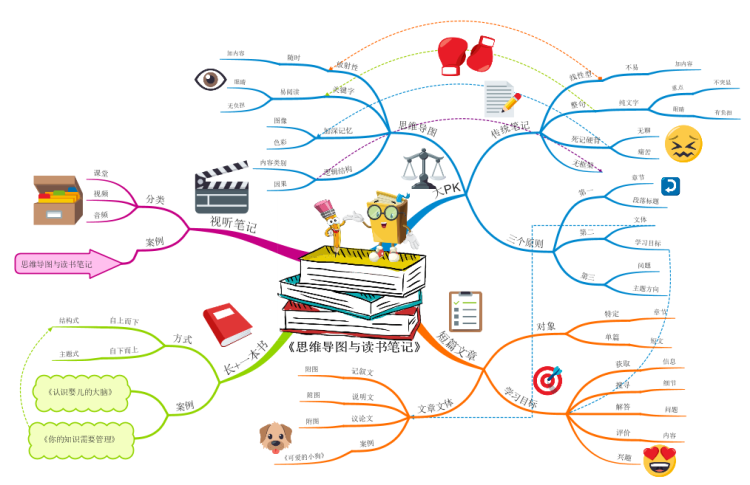
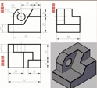

### ✍️ Tangxt ⏳ 2021-10-05 🏷️ What

# 系统性思维

- [看 up 在讲清华特奖学习秘籍，我啪地一下进来了，很快啊 - 知乎](https://www.zhihu.com/zvideo/1313116514489978880)
- [看 up 在讲清华特奖学习秘籍，我啪地一下进来了，很快啊_哔哩哔哩_bilibili](https://www.bilibili.com/video/BV1Py4y1q7xR)

> 讲讲许多朋友要求的摸鱼学习秘籍。强调：我本人不是清华特奖（差的很远）。但我确实从几位曾经交流过的特奖学长身上学到了很多，因此结合我这边的经验给大家诚心诚意地讲一讲我总结的特奖学习秘籍之摸鱼人版。如果喜欢本次视频，你要记得关注我+交流哦~

朋友们好，我是摸鱼派学徒覃含章。刚才有些朋友问我秦同学发生什么事了，我说怎么回事？给我发了几条私信，我一看，原来是昨天有两个年轻人，十几岁，一个眼镜度数 1000 多度，一个每天只睡三个小时。他们说我刷题刷的视力模糊，压力很大，精神恍惚，保证不了睡眠质量。覃同学，你能不能教我摸鱼派的学习秘籍，帮助减轻一下我的学习压力。

我说可以，我说你刷题那是学死知识，不好用，他不服气。我说小朋友：你们两个一起上来考我高等数学+线性代数，他考不动，他说你这也没用，需要智商和天赋，我说我这个有用，这是系统性思维，智商天赋只是 buff，不是决定性的，**我们摸鱼人追求高效率，学习的时候，优先找知识和知识之间的联系点**。

我这招啊，其实是当年从本校的特奖大神学长那儿学来的。

当然，如果你能掌握摸鱼心态之摸鱼派的内功心法，这招你或许也就不用练了。详情我 [这期视频](https://www.bilibili.com/video/BV1SK411A7Qs) 有讲，当年我在高中许多做题派学徒都不服气，喜欢和我较劲，我一直都是说可以，你们随便来。哎那些做题派每天早上啪地就开始做题，很快啊！然后上来就是一个五年计划，三年模拟，一个黄冈试卷，一个龙门书局，我全部防出去了啊！防出去之后自然是摸鱼派风尚，点到为止，一张满分卷子放他面前他没说话，我笑一下，准备收回卷子，这时候，按考试排名的点到位置，他已经输了，如果我再说句话，一句话就把他意志摧毁了。所以卷子放他面前不说话，他也承认我并没有花他的时间那么多，刷那么多题，却考得比他好。我本来已经准备不说话，收卷了，他突然袭击，开始跟我比竞赛题了，我大意了啊，没有闪。他弄出一些数竞组合题确实不好做，但没关系啊！他也说两分多钟以后当时做不出题，流眼泪了，捂着眼，我说婷婷，然后两分钟以后就好了。

我说小伙子你不讲考德你不懂。他说覃同学对不起，对不起，我不懂规矩，他说他是乱做的，他可不是乱做的，组合恒等式+容斥原理，训练有素，后来他说他练过三四年数学竞赛，看来是有备而来。这两个年轻人不讲考德，来刷题来偷袭我这个 18 岁的老同志，这好吗？这不好。我真心地劝这样的年轻人好自为之，好好反思，以后不要再犯这样的聪明和小聪明，同学之间要以和为贵，要讲考德，不要搞内卷。

上面关于摸鱼派可以战胜做题派的故事，许多朋友可能会有疑惑啊，说你覃含章又开始吹牛皮了，跟网上那个马老师有什么区别？那么我这一次再讲一个无招胜有招的传奇人物，这个人的存在可能同时超越了摸鱼派和做题派的上限。我想可以说她是一位「逍遥派」的女侠。这位女侠的故事其实是我上了大学，我的寝室室友告诉我的，因为女侠本人在他们那个省超级中学也是所有人高山仰止的对象。

这位女侠怎么学习的呢？她从不需要任何教辅或者参考材料，因为她的学习心思全部在许多同学觉得干瘪乏味的课本上。那么这里许多同学可能就要奇怪了，课本上有什么好东西，又没有题可刷，这怎么能学得好？这就是逍遥派女侠的独门秘籍了。

在摸鱼派同学在课本上画画，刷题派同学抛弃课本去刷辅导资料的时候，女侠的时间都花在钻研课本本身上了，据我室友也是女侠同学回忆，薄薄一页乏善可陈的课本内容，女侠却往往可以以出人意料的角度提出各种各样的连深谙课本的任课老师都没考虑过的问题，在书上每个空白的地方都留下密密麻麻的注解。另外，即使是课本上已有的解法，女侠也不满足于照搬全收，而是会每一行推导，每一个句子都细细琢磨，最终她可能会独立发现许多新的不同于课本的解法，继续惊艳众人。

女侠这个过程其实简单来说是一个把书读厚的过程。我这里其实也援引了华罗庚老爷子的说法，即读书的过程应该就是要先从薄到厚，再从厚到薄。我想这也是两种不同的思维和推理模式，**前一种从薄到厚，这叫做演绎，后一种从厚到薄，这叫做归纳**，也就是说我们在学习一个新的学科，往往先有深刻认识的都是个体和一些特例，然后我们会渐渐将这些特例一般化推及到很广泛的范围，但最终我们将在这些广泛之中找到学科知识的内核，将学科的精华提炼出来，加以内化。最终通过这一整个过程，我们就能得到所谓的系统性思维，即该学科所有的知识碎片在我们的脑海中都是相互缠绕和链接的，谁也离不开谁，这就算真正学到位了。

多说一句，这也是目前人类认知事物比所谓的弱人工智能要优越的地方。因为其实每个人从婴儿开始就具备系统性思维的能力。

比如：你在一场 F1 比赛现场看到一辆法拉利赛车，爸爸妈妈告诉你这个东西叫做车子，你又看到一辆家里的玩具奥迪，爸爸妈妈也告诉你这东西是车子，那就好了。以后你就算在电视上看到一个平面的家用汽车广告，你也就马上知道这是一种车子，这种只需要根据极少数数据做系统性归纳和推理的能力，目前的机器学习算法其实是完全没有办法做到的。

那么本视频剩余时间，我们就来仔细讲讲这个「系统性思维」。其实大家都具备这个能力，你只是需要会运用它就好了。

我前面也提到了，这其实是我当年大一还懵懂的时候，两位特奖学长教给我的方法。这两位学长虽然看起来学习习惯迥异，但是异曲同工，核心就是这系统性思维，两位学长一个戴眼镜，一个不戴。我先讲讲这位戴眼镜的学长，因为不戴眼镜的学长学习风格可能有点过于飘逸，先卖个关子。

大一学理工科的同学们基本都要面对微积分、线性代数的洗礼。对于这高等数学课程，眼镜学长的心得就是你真要把它当成一棵「高树」，也就是说你要能够把高数整理出一个脉络，根据这条脉络就会有各种分支、各种知识点，就像一个树形结构，这个结构也常常被叫做思维导图。我这里给大家一个实例：

从网上找的，这里具体的树的结构和细节并不重要，因为重要的是你要能够自己在头脑里把所有知识串联起来，也就是所谓的融会贯通。

当然了，一般来说，先需要把薄薄的高数书读厚，最后才能真正的从厚读薄，因为如果你只是像跟我一样在网上找个高数思维导图，没有自己用功，只是抄了一下图，那其实完全不会有效果。因为重要的就是这个将知识内化的过程，只要你真的内化，有没有这张图画出来其实都不重要了，因为这张图会早已深深地印在你脑海当中了。

好了，前面讲了高数，如果有些还没上大学的观众小朋友，这个道理其实是共通的。

比如我自己高中学化学的时候，直到高三之前，我总觉得自己化学每次都不太稳，因为每次考试我总是发现自己要么在实验题会有知识盲区，要么在有机合成或者其它地方会掉链子。但是高三第一学期的时候，我专门在一整个月中，每天抽出时间按照教学大纲，从头到尾把所有高考可能涉及的知识点撸了一遍。

注意，我在做这件事情的时候，其实是所有的知识我都至少在课堂里已经学过，在作业里练过，在考试里实战过了。

> 我学前端的时候，方方也是把前端知识大概过了一遍

重点是什么？我在复习每个章节的时候，都会拿出一张白纸，把大纲里的重点比如常用的方程式、元素周期表、分子结构，各个实验要点写上去，用不同颜色的笔进行标注，并最终对相关知识点做链接。

在高中化学里，主线其实就是那些个常见的化学元素，它们作为单质有着不同的性质，比如价位、氧化性等等。组成化合物的时候也会有不同的性质，像是颜色或者各种化合反应。当然，无机物和有机物差别挺大的，这些不同的元素形成的化学物质也有许多独有的实验性质等等。

总之，在那个学期，我其实把整个高中化学的知识体系画成了一棵纸上的大树。从此妈妈就再也不用担心我的化学考试成绩了，因为老师你随便考，我随便秒杀。那么这个就是我个人的另一个系统性思维的实例。

> 内化的一个过程……内化的最终结果是一颗知识体系树啊

我叨叨了半天，完全忽略了学文科的同学，一方面原因当然是因为我是个理科生，自然举的例子偏重理科，但是你一定要我说的话，我这个人脸皮厚，我其实是一个文科也很好的理科生，不妨简单讲讲，因为毕竟从小考试排名，计排名的课程越多，也就除了语数外这些主科，理化生政史地这些副科计入的排名越多，我的排名就越稳。直到上了大学。我都大三了，作为一个理工科本科生，在哲学系同级的专业课上，那会我上的挺多的，许多人文学院教授还是把我也当成他们自己的学生，这里的关键就在于我并不认为系统性思维这套学知识的内功（应该是外功）方法就不适用于学本科，以许多哲学专业的课程为例，仍然要先把书读厚再把书读薄。因为许多哲学家原本的文字就非常晦涩，这个时候需要研读大量的注解，甚至许多注解书先去准确掌握原典具体表达的信息和意思，然后才要一步步将繁琐的哲学原典的核心思想加以提炼，形成最终的课程报告或者你自己的哲学思考。

好了，压箱底的故事是前面一直按着没讲的不戴眼镜的那位特将学长。此人在得特奖之前也早就是系里的风云人物，一方面是因为他非常厉害，但另一方面是因为他厉害地很特立独行。

此君的名言就是**学校的教授水平都太次，与其背着书包，每天按部就班地在教室里浪费生命，不如远走高飞**。于是即使是同寝室的哥们也从不见他写作业或者上课。

当然，后来他们知道特奖哥其实那个时候就在自主做科研了，可是每门课总归要考试的呀，每门课快要考试的时候，也终于是寝室哥们能见到他本尊好好「学习」的时候，或许应该说是在抱佛脚。但我觉得准确的说法是，这个时候特奖哥开始发功了。根据他的亲室友描述，特奖哥抱佛脚就跟闭关一样，手里就拿了一支笔、几张白纸、一本课本，找个小黑屋，一头进去。一天一夜之后，特奖哥从小黑屋出关，手里拿着写得满满的几张白纸。据他本人的说法，这几张纸就是这一整门课的「精华」。

那么后面的故事就很枯燥了，特奖哥学一门课只需要这么闭关一下，就把全系的同学秒了，而由于他的独特学习方法，给他省下了大量自主学习、做科研的时间和精力。他的本科生科研就秒杀了大部分同领域的无论是国内还是国外最优秀的博士生，最终他也去了他本科就合作过的教授那儿读博，现在已经在加州大学伯克利分校做助理教授，可以说非常的年轻有为了，我这里也不做过多解读了。

听到这儿，各位应该已经明白，这位潇洒特奖哥就和前面的眼镜特奖哥还有女侠一样都是系统性思维的高手，这也是他们能够比同龄人学习能力强出一个层级的重要原因。

对了，说起女侠，我当年读高中的时候，也有一位永远的传奇女神，是我的高中学姐，因为她最后去了普林斯顿读本科，就叫她普林女神吧。这位女神高中的时候。被同班同学给的绰号是「妖怪」，因为无论什么学科，语数外还是数理化还是其它，女神永远是第一名。如果女神某次表示发挥地不太好，那也就是变成领先第二名优势不那么大的第一名而已。这位女神也曾创造过同时拿到本市数学竞赛一等奖、物理竞赛一等奖、化学竞赛一等奖、英语竞赛一等奖和作文竞赛一等奖的神迹。

女神高三的时候早早确定了普林的 offer ，但为了不给自己的人生留下遗憾。她选择为校争光，顺手参加了高考，顺手高分进了北大，然后十分冷漠地拒绝了北大。这个例子说明真正会学习的人从来都不会偏科，因为他们都是系统性思维的集大成者，兵来将挡，水来土掩，学啥都能学得特别好。

好了，今天讲了许多神人的故事，但如果你听到了最后，我希望你对系统性思维有一个比较好的认识，还不快快在你日常的学习中使用它？

当然，我这边总结一下。

一个具体学科的系统性思维的形成，是一个把书读厚再把书读薄的过程。首先读一本书，每个生字都查字典，每个不懂的句子都进行分析，每个不懂的环节都加上注释，这样确实懂多了，书也厚多了。但是这还不够，因为每一章、每一节、每一字、每一句都懂了，**还不是懂的最终形式**。

我们必须再经历由厚到薄的过程，必须把已经学过的东西咀嚼消化、组织整理、反复推敲、融会贯通，提炼出关键性的问题来，要看出其来龙去脉，要抓住重点（要点），再和以往学过的知识比较，弄清楚究竟添了什么新内容、新方法。这样之后，就会最终发现书变薄了，也只有这样经过真正消化过的东西才容易长久记忆，并得心应手的运用。

视频最后再谈谈本人上次摸鱼视频的一些争议。许多朋友觉得我可能就是在纯炫耀没有干货。但事实上**我仍然要说心态是最重要的**。当然至于是否是摸鱼派还是做题派，其实关系并不那么大，你的门派自然你自己说了算，我自己天天标榜摸鱼人，当然也不可能是完全不做题的，我只是要强调，我真不觉得题海战术是每个人学习的最佳方法，而且在我的生活中见到了太多人，有着太多宏伟的目标和计划，最终却没有一个很稳定的心态去执行它。

正好这期视频我主要在用武林的比喻，心态就像内功，今天讲的系统性思维就像外功，外功再花里胡哨，内功没法支撑，那也无法完美地发挥其效。就像前面说的两位特将学长，我觉得心态都非常强大，潇洒特奖哥自然不必多言。而另外那位眼镜特奖哥他自己讲，自己醒着的时候无时不刻都沉浸在对知识的咀嚼当中，比如一门机械制图课刚刚下课，他骑着自行车去吃饭的路上看到了园子主干道两旁的树，他就会开始在脑中对这个树开始做三视图投影：

就是从不同角度去投，及时消化刚刚学习的知识。他当然很聪明，但我想每个人也都可以学学他的「内功」，就是强大的心态和定力吧。好嘞，那今天视频就到这儿，谢谢朋友们！

> 看完十分有感触。知识本身是十分廉价的。在不断探索出得到的经验才是珍贵的。只有曾经不断试错，最终才能殊途同归。先建立框架，再往框架里面填充内容，最后通过框架间联系加深印象，本质与内核都是十分一致的

> 和就是钱学森看待问题的方式有异曲同工之妙，他认为必须从系统的角度来理解事物，从局部和整体的关系上来把握问题

> 我就是这样学习的。主“研究”书本，做题对我来说就是保持手感和巩固加强印象的作用

> 高中的时候我也经常在上课的时候想到很多新的东西，但是心态真的很重要，要抱平常心去看待学习，急功近利三心二意会让这种学习方法完全失效，不满足于专注于知识本身，透过现象看本质是很重要的

> 1，先把书读厚，只要是把书上所有的东西理解
> 
> 2，把书读薄，把每一章的东西都联系起来

> 视频中：知识与知识之间的联系点，和陈虻老师的“做思想体操”异曲同工。他大学的读书笔记，不抄结论式的名言警句，他记下的是在论据阐述之后，论点和论点之间的过渡段。他认为这是思维的转折点。所学的专业和从事的职业不相干，他既不遗憾也不庆幸，“与知识相比，有一个更需要注意的，那就是思维方法，包括你接受新知识的能力，包括你判断和处理信息的能力，它应该比知识更重要。”

> 感觉你的说的外功，就像费曼说的名言：我不能创造的我都不能理解。

💡：博主有时觉不觉得学习很累，是方法不对吗？比如说，提到的下课后就对树进行三维分析，为什么给我的感觉是，好累，好不容易下课了还不去想想其他的。

嗯这个就是内功了，学习累么？用功这件事情本身肯定是要“做功”的（人不做功，就很难进步）。不过定力好的人可以很好地集中自己的注意力，高效完成该做的事情。就比如，我的感觉是，一边骑着车一边思考，其实可能比坐在桌子面前强迫自己思考更容易让自己进入状态

💡：系统性思维和系统思考有关联吗？我知道一本叫系统之美的书，里面有系统思考这个词。

类似的

💡：内功如何训练呢？求教

内功（心态）比外功更难练哈哈，可能不是视频能完全讲清楚的，而且容易产生争议，我先把内功修炼的议题放一下

💡：那么学长做思维导图的时候是自己思考的还是从课本摘抄整理，高一很幸运刷到这个了，最近正在愁怎么提高成绩，打起了刷题的念头

摘抄的内容是基础，但我会讲最终形成的版本最主要需要自己的提炼总结+思考

💡：想问一下 up, 就一直啃书？你啃书的时候应该有个方向吧，应该朝着什么方向去看

呃，这个问题很宽泛哈，啃书的方向也跟你在学什么学科有关系

💡：哈哈，我朋友也是一直都不服气为什么永远考不过我这个“摸鱼”的

上了大学以后大概挖课本的笔记我要整理三次吧（其实也就是三个阶段），刷题也就起个进一步理解实践的作用。其实高中就有点这样的雏形了，可惜比较死板的大环境一直都不太待见这种不太立竿见影的方法，多数人追求的是立刻就能上手做题，反正特别谢谢物理老师，他的授课就是这种体系式，在最基础的物理模型上进行进一步加深或者结合，我觉得这种掌握一个就能掌握一片的方式特别好